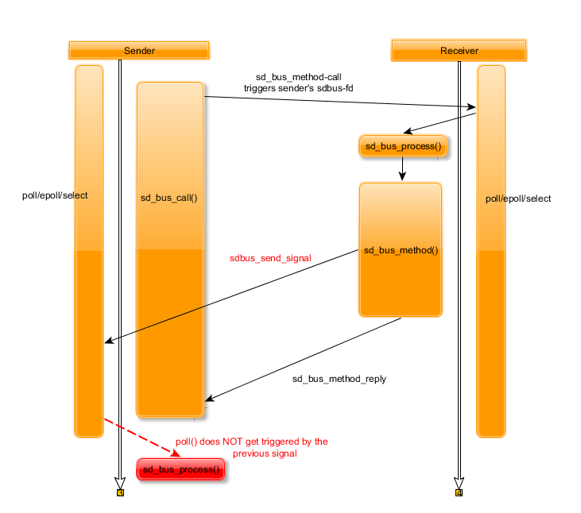

# dbus-missing-signals-or-fd-issue
This project shall show an issue I faced when working with dbus-signals while listening to the dbus-fd.

An application does not receive dbus signals on its dbus file descriptor while waiting for a dbus-method response (considered time frame: between sending the method-call and receiving its response).  
After the response is received, the (indefinitely) queued signal is not delivered unless another signal / method call is being received.  
The basic setup: Two applications are
communicating via dbus, using a select()/poll()/epoll() loop waiting for events on their dbus-fds.  

The faulty procedure provoking the issue:
- Triggered by a timer event, Application A calls the dbus-method "transmit" of
  application B.  
- During processing of the “transmit”-method, application B broadcasts a
  dbus-signal on which application A is matched on.  
- Afterwards, application B sleeps for 5ms and then finishes its “transmit”-method
  by sending a response message towards application A.  
- Subsequently, the dbus-fd of Application A (carrying the queued signal from Application B) does not trigger the select() (same for epoll() if implemented so).  

Though  
- when triggering sd_bus_process() manually, the signal is being received in
  application A. The signal was obviously received and queued, but
  the event was not signalled.  
- other processes, not being “blocked” by waiting for a response-message, did also
  receive the signal.  

Illustration:  
  

I saw this behavior on multiple platforms, e.g. Linux kubuntu 4.4.0-137-generic
with 229-4ubuntu21.1 and Debian Buster 4.18.0-2-am64 with systemd 239-10.  
Attached you can find a simple example, including application A / B, a makefile
and the correlating *.conf-files.

To reproduce the minimal, faulty example:

*wget https://github.com/mue-jan/dbus-missing-signals-or-fd-issue/archive/master.zip*  
*unzip master.zip*  
*sudo cp \*.conf /etc/dbus-1/system.d/*  
*make*  
*# start applications in different terminals*  
*./mbsp_signal_receiver*  
*./mbsp_signal_sender*  
*# observe the sender for 10s, missing every signal being sent by the receiver* 
